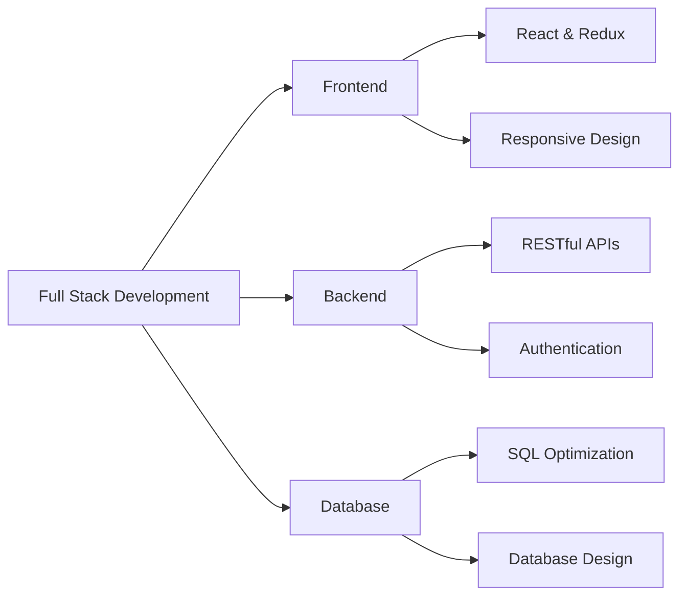

<div align="center">
  
</div>

<h3 align="center">Full Stack Developer | MERN + SQL | Passionate about creating seamless user experiences</h3>

<p align="center">
  
  
  
  
</p>

---

### 👨‍💻 About Me
```javascript
const rashid = {
    pronouns: "He" | "Him",
    location: "India 🇮🇳",
    currentRole: "Full Stack Developer",
    currentlyLearning: ["Advanced React Patterns", "System Design", "PostgreSQL Optimization"],
    techCommunities: {
        learning: "Building in public",
        interests: ["Web Development", "API Design", "Database Architecture"]
    },
    funFact: "I turn coffee into code ☕️ → 💻"
};
```

- 🔭 I'm currently working on **Full Stack Web Applications using MERN Stack**
- 🌱 Constantly learning **React Advanced Patterns, Node.js Best Practices & SQL Optimization**
- 💬 Ask me about **JavaScript, React, Node.js, Express, MySQL, PostgreSQL**
- 📫 Reach me at: **[LinkedIn](https://www.linkedin.com/in/rashid-sidhpura-232610336)**
- ⚡ Fun fact: **I love turning ideas into reality through code!**
- 🎯 2025 Goals: **Contribute to Open Source & Build SaaS products**

---

### 🛠️ Tech Stack & Tools

<table>
<tr>
<td valign="top" width="33%">

#### Frontend 🎨
<div align="center">


</div>
</td>

<td valign="top" width="33%">

#### Backend ⚙️
<div align="center">


</div>
</td>

<td valign="top" width="33%">

#### Database 🗄️
<div align="center">


</div>
</td>
</tr>
</table>

#### Tools & Platforms 🔧
<p align="center">
  
  
  
  
  
  
</p>

---

### 📊 GitHub Analytics

<div align="center">
  
  
</div>

<div align="center">
  
</div>

<div align="center">
  
</div>

---

### 🏆 GitHub Achievements

<p align="center">
  
</p>

---

### 💼 Experience & Projects


#### 🚀 Featured Projects

<div align="center">

| Project | Tech Stack | Description | Link |
|---------|-----------|-------------|------|
| 🔥 **E-Commerce Platform** | React, Node.js, MySQL | Full-featured online shopping platform with payment integration | [View →](#) |
| 📱 **Social Media App** | MERN Stack, Redux | Real-time social networking application | [View →](#) |
| 🎯 **Task Manager** | React, Express, PostgreSQL | Collaborative task management system | [View →](#) |

</div>

---

### 📈 Coding Activity

<!--START_SECTION:waka-->
<!--END_SECTION:waka-->

<div align="center">
  
</div>

---

### 🎯 What I'm Up To

- 🔨 Building scalable **MERN Stack applications**
- 📚 Learning **System Design & Architecture**
- 🤝 Open to collaborate on **Full Stack projects**
- 💡 Exploring **PostgreSQL advanced features**
- 🌱 Growing my **GitHub presence**

---

### 💬 Random Dev Quote

<div align="center">
  
</div>

---

### 🐍 Contribution Snake

<!-- <div align="center">
  
</div> -->

<div align="center">
  
</div>

---

### 🤝 Connect With Me

<p align="center">
  <a href="https://www.linkedin.com/in/rashid-sidhpura-232610336" target="_blank">
    
  </a>
  <a href="mailto:rashid.sidhpura@example.com">
    
  </a>
  <a href="https://github.com/sidhpurarashid">
    
  </a>
  <a href="https://twitter.com/yourhandle" target="_blank">
    
  </a>
</p>

---

<div align="center">
  
</div>

<p align="center">
  
  
</p>

<p align="center">
  <i>⭐️ From <a href="https://github.com/sidhpurarashid">Rashid Sidhpura</a> - Let's build something amazing together! 🚀</i>
</p>
